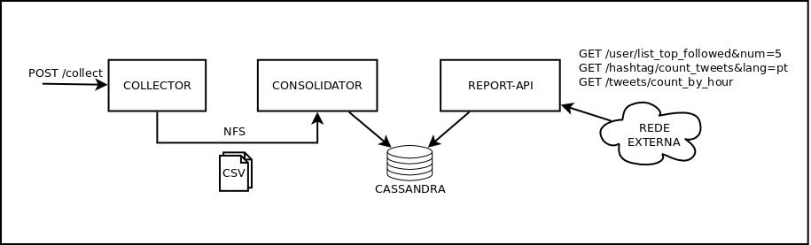
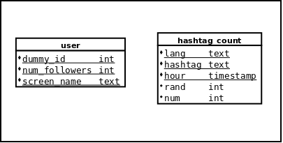
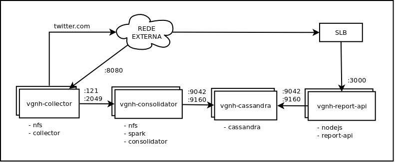

# Relatório Técnico

**Objetivo:** este relatório é a resposta ao item 8 do teste e descreve a solução encontrada para implementação.

## Repositórios

**Repositório Github:** <https://github.com/acasimiro/vgnh>

**Imagem Docker:** <https://hub.docker.com/r/acasimiro/vgnh/>

## Desvios do plano original

| Desvio | Motivo |
|--------|--------|
| O componente `colector` deixou de escrever no cassandra e passou a escrever em arquivos no sistema de arquivos local. | Melhor escalabilidade horizontal, menor número de dependências, menor gargalo de escrita no Cassandra. |
| Deixei a construção do ambiente Docker para o final. | Focar nas prioridades e evitar comprometer a construção da aplicação. |
| Alteração do endpoint `GET /tweets/count?granularity=hour` para `GET /tweets/count_by_hour` | Esse era um requisito desnecessário que aumentaria a muito a complexidade da solução |

## Tecnologias utilizadas

### collector

 - **Java 8:** linguagem orientado a objetos de uso geral com larga utilização de mercado.
 - **Springboot:** framework para construção de aplicações Java com solução para problemas comuns.
 - **Tomcat:** servidor de alto desempenho para aplicações web.

### consolidator
 - **Scala:** linguagem que une os paradigmas "funcional" e "orientado a objetos", roda na JVM e tem boa integração com Java. É a linguagem nativa do spark pois o paradigma funcional isola os pontos de concorrência e facilita o processamento em paralelo de grandes quantidades de dados.
 - **Spark:** ferramenta de processamento em batch construída para substituir o Hadoop Map Reduce, lidando de maneira mais otimizada com processos custosos como a serialização de dados para o disco e a redistribuirão dos mesmos entre os nós. Escrito em scala, possui API para scala, Java, Python e R e está em desenvolvimento ativo pela comunidade.
 - **Spark streaming:** ferramenta de processamento contínuo em micro-batch que reaproveita a engine do spark para processamento.

### report-api

 - **Nodejs:**
 - **Expressjs:** framework para rápido desenvolvimento de aplicações em nodejs.

### Ambiente
 - **Ubuntu linux:** distro de Linux com facilidades no gerenciamento e instalação de pacotes. Em contrapartida, não possui tanta preocupação com segurança como RHEL ou CentOS.
 - **Cassandra 3.0:** banco de dados colunar distribuído e replicado. Possui alta disponibilidade e tolerância a falhas.

### Ferramentas de desenvolvimento
 - **Intellij:** IDE para desenvolvimento multi linguagem.
 - **Sublime text:** editor de texto com funcionalidades que aumentam a produtividade.
 - **Maven:** ferramenta para automatização de tarefas relacionadas ao ciclo de desenvolvimento de software: compilação, teste, empacotamento e entrega.

## Diagrama de arquitetura

###### Fluxo
1. `collector` recebe requisição de coleta de tweets para uma hashtag
2. `collector` busca tweets no twitter
3. `collector` escreve arquivo com tweets recuperados no NFS
4. A cada X segundos o `consolidator` detecta novos arquivos no NFS e inicia processamento
5. Consolidação em dois fluxos, um para a tabela `user` e outro para `hashtag_count`
6. `report-api` recebe requisição de consulta
7. Faz consulta no cassandra
8. Devolve resposta para o usuário

**OBS:** Apesar de ter muito mais conhecimento em Python escolhi Scala para a contrução do `consolidator` pois já tive problemas com APIs não portadas do spark (scala) para o pyspark, então quis evitar surpresas e consequente possível retrabalho.

## Modelagem da base de dados

**OBS:** Cassandra parece não ser uma boa ideia para a consulta de TOP 5 usuários com seguidores devido a limitações da cláusula para colunas fora da chave. Em meu entendimento a duas soluções viáveis:

1. Usar uma chave primária "dummy" e aproveitar a ordenação das colunas secundárias da chave. Escolhi essa solução por ser mais simples, mas ela sofreria do problema de desbalanceamento de carga dos nós do cluster Cassandra.
2. Usar N chaves, uma para cada nó do cluster, mas isso exigiria executar N consultas.

## Diagrama de implantação

###### Perfil das máquinas
 - `vgnh-collector`: RAM: 8~16Gb, Disco: 100~200Gb
 - `vgnh-consolidator`: RAM: 8~16Gb, Disco: 100~200Gb
 - `vgnh-cassandra`: RAM: 16~32Gb, Disco: 1Tb
 - `vgnh-report-api`: RAM: 2~4Gb, Disco: 20Gb

###### Comentários
 - Componentes construídos em forma de micro-serviços, possibilitando dimensionamento individual
 - Portas listadas para liberação de ACLs

## Referências utilizadas
 - **Livros**
    - *Cassandra: The Definitive Guide - O'Reilly*
    - *Learning Spark - O'Reilly*
 - **Docs**
    - [Spring Boot Reference Guide](http://docs.spring.io/spring-boot/docs/current-SNAPSHOT/reference/htmlsingle/#getting-started-first-application-executable-jar)
    - [ExpressJS API reference](https://expressjs.com/en/4x/api.html)
 - **Artigos**
    - [Getting Started · Building an Application with Spring Boot](https://spring.io/guides/gs/spring-boot/)
    - [Getting Started with Apache Spark and Cassandra - DataStax Academy](https://academy.datastax.com/resources/getting-started-apache-spark-and-cassandra)
